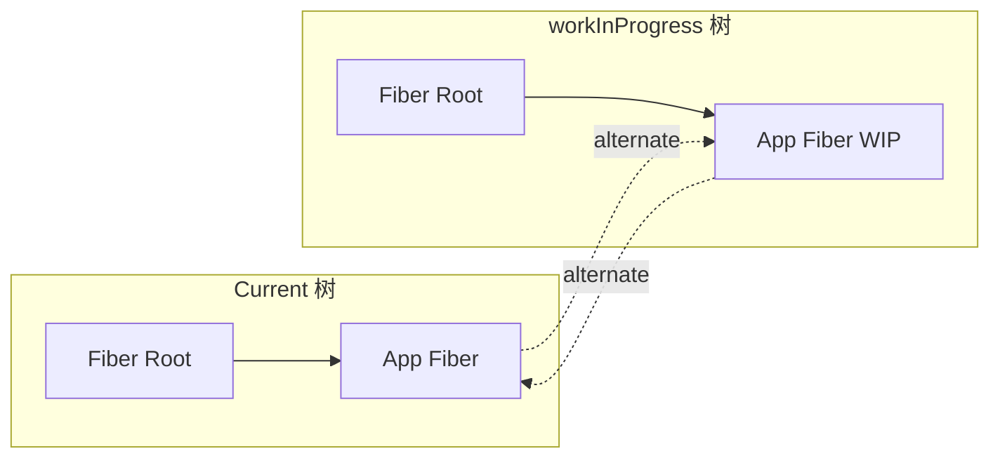
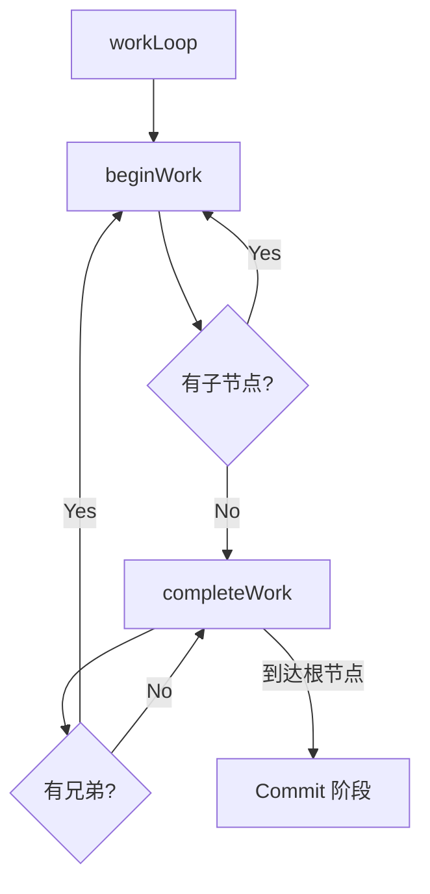
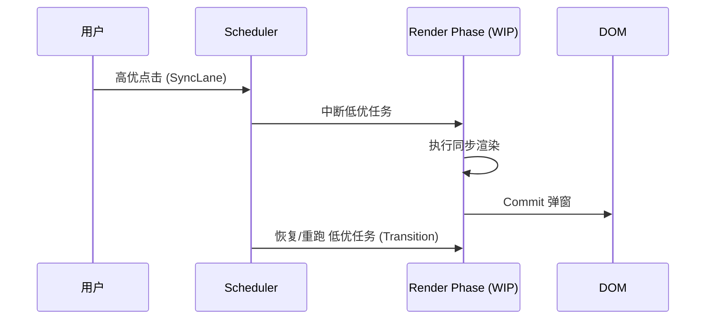

# React 18+ 源码核心架构全解析

本篇笔记总结了 React 18 异步并发架构的核心实现原理，涵盖从 Fiber 节点到并发调度的全链路流程。

## 1. 核心架构：Fiber 与 双缓存机制

React 放弃了传统的递归渲染，转而使用 Fiber（单向链表）来模拟调用栈，实现了“可中断”的渲染。

- **Fiber 结构：** `child` (第一个子节点), `sibling` (下一个兄弟), `return` (父节点)。
- **双缓存 (Double Buffering)：**
    - `current`：当前屏幕显示的树。
    - `workInProgress`：正在内存中构建的“草稿树”。
    - **意义：** 保证了渲染的原子性，防止用户看到中间状态。



## 2. 渲染流程：Render & Commit

### Render 阶段 (可中断)
通过深度优先遍历 (DFS) 处理 Fiber 树。
- **beginWork (递)：** 根据 `tag` 创建/更新子 Fiber，执行 Diff 算法。
- **completeWork (归)：** 构建 DOM 实例，初始化属性，将子树副作用 (`subtreeFlags`) 冒泡合并。

### Commit 阶段 (同步，不可中断)
1. **BeforeMutation：** 获取快照 (getSnapshotBeforeUpdate)。
2. **Mutation：** 真正操作 DOM (增删改)。**在此之后切换 `root.current = finishedWork` 指针。**
3. **Layout：** 执行同步 Effect (useLayoutEffect)。



## 3. Diff 算法：最小化 DOM 变更

React 采用 $O(n)$ 复杂度的 Diff 策略，关键点在于 `lastPlacedIndex`。

- **单节点比对：** 优先匹配 `key`，其次比对 `type`。
- **多节点比对 (两轮遍历)：**
    1. 第一轮：尝试逐个复用位置未变的节点，一旦 `key` 不匹配则中断。
    2. 第二轮：将剩余旧节点存入 Map，根据 `key` 查找复用。
- **移动判定：** 如果复用节点的旧索引 < `lastPlacedIndex`，则标记为 `Placement` (移动)。

## 4. Hooks 原理：链表与闭包

- **存储结构：** Hooks 以单向链表形式存储在 Fiber 节点的 `memoizedState` 属性上。
- **执行环境：** 渲染时通过 `Dispatcher` (挂载/更新) 切换函数。
- **限制：** 必须保证顺序一致，因为 React 靠指针位移来读取对应的 Hook 状态。

## 5. 并发特性：Suspense 与 Lanes

### Suspense
- **挂起：** 组件抛出 (throw) 一个 Promise。
- **捕获：** `workLoop` 捕获异常，回溯到最近的 `Suspense` 边界。
- **展示：** 切换到 `fallback` 节点，并将原内容包裹在 `Offscreen` 中隐藏。

### Lanes (车道模型)
使用 31 位位掩码表示优先级，支持任务合并、优先级插队与中断。



## 6. 关键代码片段参考

### 并发循环 (Concurrent Loop)
```javascript
function workLoopConcurrent() {
  // 每一轮处理后检查是否需要将控制权交还浏览器
  while (workInProgress !== null && !shouldYield()) {
    performUnitOfWork(workInProgress);
  }
}
```

### 副作用冒泡 (Effect Bubbling)
```javascript
// 在 completeWork 阶段
parent.subtreeFlags |= child.subtreeFlags;
parent.subtreeFlags |= child.flags;
```

---
**待办与进阶：**
- [ ] 深入研究 Server Components (RSC) 的流式传输协议。
- [ ] 探索 React Compiler 如何通过静态分析优化渲染性能。
