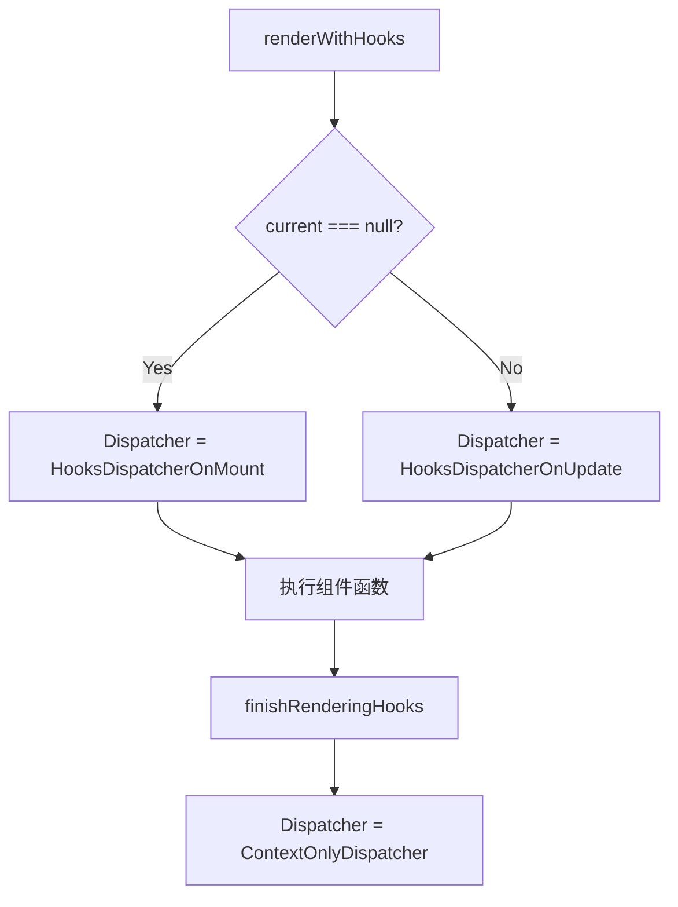
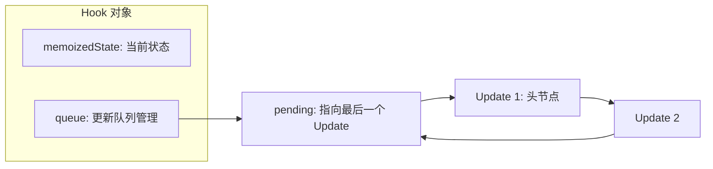

# React 常用 Hooks 实现原理深度总结

本篇笔记总结了 React 18+ 中核心 Hooks 的底层实现机制，涵盖了从 Dispatcher 分发到 Fiber 链表存储的完整路径。

## 1. Hooks 的分发中心：Dispatcher 机制

React 通过 `ReactCurrentDispatcher` 实现了 Hooks 在不同生命周期的“人格切换”。

### 核心逻辑
- **Mount 阶段**：使用 `HooksDispatcherOnMount`，负责创建 Hook 对象并构建初始链表。
- **Update 阶段**：使用 `HooksDispatcherOnUpdate`，负责读取旧 Hook 状态并处理更新队列。
- **检测报错**：在组件外使用时，切换为 `ContextOnlyDispatcher`，调用 Hooks 会直接抛错。



## 2. 状态管理：useState 与 useReducer

`useState` 本质上是预设了 `basicStateReducer` 的 `useReducer`。

### 关键数据结构：环形链表
更新任务（Update）存储在 `hook.queue.pending` 指向的环形链表中。
- **优势**：$O(1)$ 时间内同时定位头节点（`pending.next`）和尾节点（`pending`）。



### 关键代码片段：dispatchSetState
```javascript
// 预绑定当前 Fiber 和 queue，确保在脱离上下文时仍能准确找到更新目标
const dispatch = (queue.dispatch = (dispatchSetState.bind(
  null,
  currentlyRenderingFiber,
  queue,
): any));
```

## 3. 副作用管理：useEffect

`useEffect` 的核心在于“两栖链表”存储。

### 存储结构
1. **Hook 链表**：存在 `fiber.memoizedState` 中，保持 Hook 顺序。
2. **Effect 链表**：存在 `fiber.updateQueue` 中，仅包含副作用，便于 Commit 阶段快速遍历。

### HookFlags 与执行时机
- **HasEffect (0b0001)**：表示依赖项已改变，本次需要执行。
- **Passive (0b1000)**：`useEffect` 专用，异步执行。
- **Layout (0b0100)**：`useLayoutEffect` 专用，同步执行。

## 4. 记忆化与订阅：Memo / Callback / Context

### useMemo vs useCallback
- **useMemo**：缓存计算**结果**。
- **useCallback**：缓存**函数引用**。
- 共同点：底层均使用 `areHookInputsEqual` 进行依赖项浅比较。

### useContext 的特殊性
`useContext` 是唯一不主要依靠 `memoizedState` 存储的 Hook。
- **存储位置**：`fiber.dependencies` 链表。
- **订阅机制**：当 `Provider` 的 `value` 改变，React 会向下遍历子树，匹配子 Fiber 上的 `dependencies` 并标记更新。

## 5. 总结对比表

| Hook 名称 | 存储位置 | 核心数据结构 | 更新触发机制 |
| :--- | :--- | :--- | :--- |
| **useState** | `memoizedState` | 环形链表 (Update Queue) | 调用 dispatchSetState |
| **useEffect** | `memoizedState` + `updateQueue` | Effect 环形链表 | 依赖项比对 + HasEffect 标记 |
| **useMemo** | `memoizedState` | `[value, deps]` | 依赖项浅比较 |
| **useContext** | `dependencies` | ContextItem 链表 | Provider 值的向下传播 |
| **useRef** | `memoizedState` | `{current: any}` 对象 | 引用持久化，不触发更新 |

## 待办事项 (Next Steps)
- [ ] 深入学习 React 调度中心 (Scheduler) 的优先权 Lane 模型。
- [ ] 探究 Commit 阶段的 Mutation 与 Layout 子阶段的具体 DOM 操作。
- [ ] 研究并发模式下的 `useTransition` 与 `useDeferredValue` 实现。
