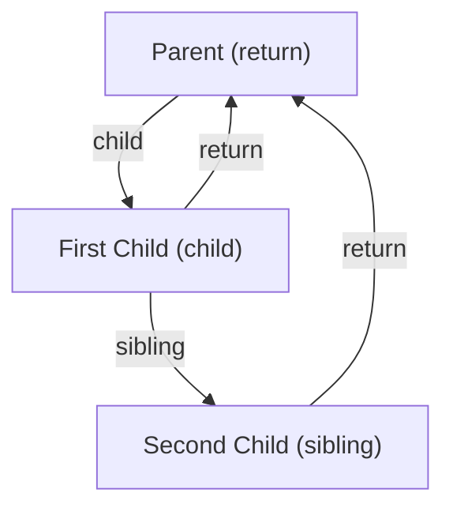

# React 18+ 核心架构与并发机制学习笔记

## 1. 从 Stack 到 Fiber：心理模型的重构
### 解决的问题
传统的递归渲染（Stack Reconciler）一旦开始无法中断，长任务会阻塞主线程，导致用户交互卡顿（主线程饥饿）。

### 关键架构：Fiber 双向链表
Fiber 将树形结构平铺为链表，使渲染过程可随时暂停与恢复。


---

## 2. 并发模式的核心：双缓存与优先级
### 双缓存 (Double Buffering)
React 内部同时维护着两棵 Fiber 树：`current` 树对应屏幕当前显示内容，`workInProgress` 树是内存中正在构建的下一帧内容。
- **意义**：保证 UI 的原子性，只有当 WIP 树彻底完工，才会进行指针交换，避免用户看到中间态。
- **alternate**：连接两棵树的对应节点，实现 DOM 实例（stateNode）的复用。

### 调度器 (Scheduler)
- **5ms 时间分片**：基于 `MessageChannel` 的宏任务调度，平衡吞吐量与响应性。
- **Lane 模型**：使用 32 位位图管理优先级，支持任务的批处理与优先级跳过。

---

## 3. Hooks 存储与状态更新
### Hook 结构
Hook 以单向链表形式存储在 Fiber 的 `memoizedState` 属性上。
```javascript
export type Hook = {
  memoizedState: any, // 当前状态值
  queue: UpdateQueue,  // 环形链表存储更新任务
  next: Hook | null,   // 指向下一个 Hook
};
```

### 更新队列 (Update Queue)
使用**环形链表**存储 `pending` 更新，优势在于能以 $O(1)$ 复杂度同时获取头节点（第一个更新）和尾节点（最新更新）。

---

## 4. Diff 算法：两轮遍历逻辑
### 策略描述
1. **第一轮遍历**：从左向右对比，Key 匹配则复用，不匹配则跳出。
2. **第二轮遍历**：将剩余旧节点存入 Map，通过 `lastPlacedIndex` 判断节点是否需要移动。

### 移动判定准则
> 如果当前复用节点的旧索引 `oldIndex` < `lastPlacedIndex`，则该节点需要标记为 `Placement`（移动）。

---

## 5. 待办事项跟踪
- [x] 建立并发架构心理模型
- [x] 掌握 Hooks 与 Lane 的底层联动
- [x] 拆解 Scheduler 时间分片逻辑
- [x] 拆解 Diff 算法两轮遍历逻辑
- [ ] **深度实战：手动追踪一个复杂 Diff 场景的 lastPlacedIndex 变化 [待开始]**
- [ ] **局部细节：合成事件系统与 Lane 的绑定过程 [待开始]**
