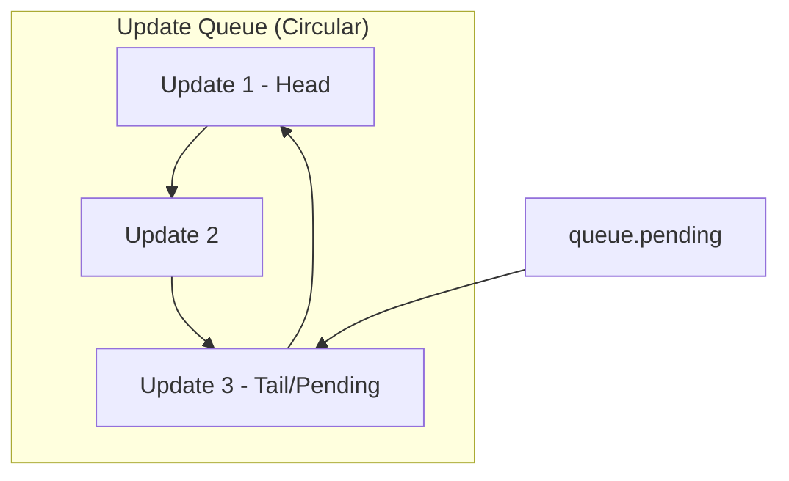
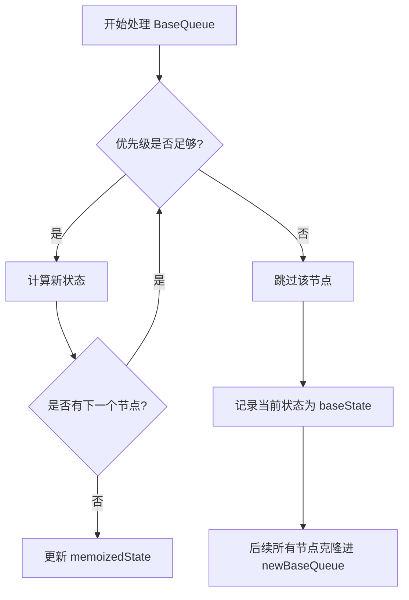
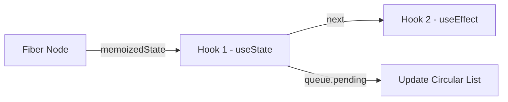

# React 状态更新与环形链表深度解析

本次对话深入探讨了 React 18+ 状态更新的核心机制，从底层的环形链表数据结构到宏观的并发调度策略。

## 1. 核心数据结构：环形链表 (Circular Linked List)

React 使用环形链表来存储 `Update` 任务，主要通过一个 `pending` 指针指向链表的**最后一个**节点。

### 为什么选择环形链表？
*   **空间换性能**：仅需一个指针即可在 $O(1)$ 时间内找到链表头（`pending.next`）和链表尾（`pending`）。
*   **插入效率**：新任务插入末尾仅需修改指针，无需遍历整个链表。

## 2. 状态更新的“断点续传”：Rebase 机制

在并发模式下，高优先级任务（如用户输入）会插队，导致低优先级渲染中断。

### 关键逻辑：
1.  **不排序原则**：Update 始终按插入顺序排列，以保证状态计算的逻辑一致性（如 `c => c + 1` 依赖前序结果）。
2.  **跳过与保留**：
    *   当遇到低优先级 Update 时，跳过它。
    *   **连坐机制**：一旦某个 Update 被跳过，其后所有的 Update（无论优先级高低）都必须保留在 `baseQueue` 中。
3.  **重基 (Rebase)**：下一轮渲染从 `baseState`（第一个跳过节点之前的稳定状态）开始，重新遍历 `baseQueue`。

## 3. Fiber、Hook 与 Queue 的架构关系

*   **Fiber**: 代表组件，其 `memoizedState` 指向第一个 Hook。
*   **Hook**: 存储具体 Hook 状态，其 `queue.pending` 存储环形 Update 链表。
*   **统一性**: Class 组件的 `updateQueue` 与 Function 组件的 `hook.queue` 在数据结构上高度统一。

## 4. React vs Vue：全量扫描与精准打击

| 特性 | React (Fiber 架构) | Vue (响应式架构) |
| :--- | :--- | :--- |
| **更新范围** | 全树扫描（Root-down） + Bailout 优化 | 组件级精准追踪 |
| **优先级管理** | 极其强大，支持中断、恢复、高优插队 | 相对较弱，以微任务队列顺序执行为主 |
| **Diff 粒度** | VDOM 全量 Diff | 组件内 VDOM Diff（结合 Patch Flags 优化） |
| **内存开销** | 极小（Update 仅为简单对象） | 较大（需要维护大量的订阅关系/Watcher） |

## 5. 调度关键函数

*   **`ensureRootIsScheduled`**: 将 Root 放入全局调度队列，并确保发起一个微任务。
*   **`markStarvedLanesAsExpired`**: 防止低优任务“饥饿”，到期后将其提升为同步优先级，强制渲染。

## 待办事项 (Next Steps)
- [ ] 深入探究 Fiber 树的“双缓存”机制（Current vs WorkInProgress）。
- [ ] 拆解 `useEffect` 的副作用链表处理流程。
- [ ] 研究 Lane 模型中位运算的优先级叠加逻辑。

---
*整理日期：2026-01-11*
