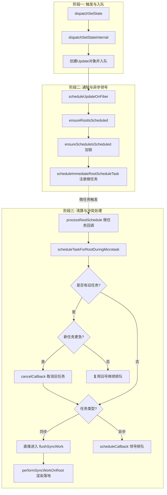

# React 状态更新与调度全流程深度解析

本次学习全面拆解了从组件调用 `setState` 到最终触发浏览器渲染的完整技术链路，涵盖了 React 18 的并发调度与自动批处理机制。

## 1. 核心技术架构

### 1.1 触发与入队 (Dispatch Phase)
*   **闭包绑定**：`dispatchSetState` 通过 `.bind` 预装了 `fiber` 和 `queue`，确保更新始终作用于正确的组件。
*   **双缓存优化 (Eager Bailout)**：若当前 Fiber 为空闲状态（`NoLanes`），React 会尝试预计算。若状态无变化，则直接跳过调度。
*   **环形链表**：更新以 `Update` 对象形式存入 `queue.pending` 环形链表。

### 1.2 调度与批处理 (Scheduling Phase)
*   **发令枪 (scheduleUpdateOnFiber)**：向上寻根，并标记 `root.pendingLanes`。
*   **微任务锁 (Microtask Lock)**：`didScheduleMicrotask` 确保同一事件循环内的多次 `setState` 只注册一个微任务，实现**自动批处理**。
*   **优先级模型 (Lane)**：利用 `lanes & -lanes` 实现最高优先级赛道的极速提取。

### 1.3 清算与执行 (Execution Phase)
*   **微任务回调 (processRootSchedule)**：
    *   **解锁**：允许后续更新再次发起调度。
    *   **分流**：同步任务（如点击）进入 `flushSyncWork`；异步任务（如 Transition）进入 `scheduleCallback`。
*   **冲突处理**：若新任务优先级更高，通过 `cancelCallback` 撤销正在排队的旧任务，实现“插队”。

## 2. 完整函数调用栈图解



## 3. 关键代码解析

### 3.1 自动批处理的核心锁
```javascript
// packages/react-reconciler/src/ReactFiberRootScheduler.js
if (!didScheduleMicrotask) {
  didScheduleMicrotask = true;
  scheduleImmediateRootScheduleTask(); // 申请微任务：Promise.resolve().then(...)
}
```

### 3.2 优先级抢占逻辑
```javascript
// 如果新任务是同步的（如点击），取消之前排队的异步任务
if (includesSyncLane(nextLanes)) {
  if (existingCallbackNode !== null) {
    cancelCallback(existingCallbackNode);
  }
  root.callbackPriority = SyncLane;
  root.callbackNode = null; // 同步任务不占用 Scheduler 槽位
  return SyncLane;
}
```

### 3.3 状态的“链式累加”
```javascript
// updateReducerImpl 中的 do...while 循环
do {
  const action = update.action;
  // 核心：newState 作为下一次循环的输入
  newState = reducer(newState, action); 
  update = update.next;
} while (update !== null && update !== first);
```

## 4. 解决的问题总结
*   **性能保障**：通过 Eager Bailout 和自动批处理减少不必要的渲染。
*   **一致性保障**：通过 `cancelCallback` 防止旧的异步任务覆盖新的同步结果。
*   **即时性保障**：点击事件通过 `SyncLane` 绕过 `Scheduler` 队列，在微任务中强制同步冲刷。

## 5. 待办事项
- [ ] 详细分析 `renderRootSync` 中 `prepareFreshStack` 如何重置渲染现场。
- [ ] 研究 `Scheduler` 的时间切片（Time Slicing）如何通过 `MessageChannel` 实现。
- [ ] 探索 `Transition` 任务在并发模式下的“可中断”特性。
