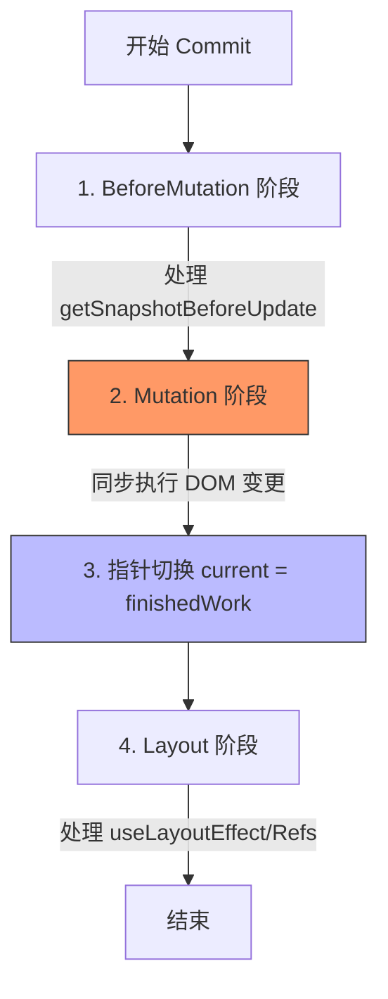

# React 的 Commit 流程与 Flags 机制

## 1. 核心技术点

### 1.1 Flags 机制 (记事贴模型)
React 通过二进制位运算（Bitwise）为每一个 Fiber 节点打上标记，记录副作用。
*   **Flags**: 当前节点自身的任务（如 `Placement` 插入, `Update` 更新）。
*   **subtreeFlags**: 子树的任务指示牌。这是 React 18+ 的性能杀手锏，允许在 Commit 阶段直接跳过无副作用的子树（剪枝优化）。

### 1.2 Commit 阶段的三阶段扫荡
为了保证 DOM 一致性，React 分步执行：



### 1.3 双缓存 (Double Buffering)
*   **finishedWork**: Render 阶段产出的“新树”草稿。
*   **原子切换**: 在 Mutation 之后、Layout 之前完成指针交换，确保用户始终看到一致的界面。

---

## 2. 关键代码片段

### 2.1 施工指令集 (MutationMask)
定义了哪些标记需要我们在 Mutation 阶段停下来施工。

```javascript
// packages/react-reconciler/src/ReactFiberFlags.js
export const MutationMask =
  Placement |
  Update |
  ChildDeletion |
  ContentReset |
  Ref |
  Hydrating |
  Visibility |
  FormReset;
```

### 2.2 剪枝遍历逻辑 (伪代码)
```javascript
function commitMutationEffects(finishedWork) {
  const subtreeFlags = finishedWork.subtreeFlags;
  
  // 核心优化：如果子树没有指示牌，直接跳过
  if ((subtreeFlags & MutationMask) !== NoFlags) {
    commitMutationEffectsOnChildren(finishedWork);
  }

  // 检查并执行当前节点的任务
  if ((finishedWork.flags & MutationMask) !== NoFlags) {
    commitMutationEffectsOnFiber(finishedWork);
  }
}
```

---

## 3. 解决的心理模型冲突

| 冲突场景 | 核心逻辑 | 结论 |
| :--- | :--- | :--- |
| **父节点被删除** | 既然整栋楼都要拆了，里面的灯泡还换吗？ | **不换。** 忽略子节点的 `Update`，只执行父节点的 `ChildDeletion`，但会递归清理副作用。 |
| **父节点仅属性更新** | 局部装修会影响其他房间的维修吗？ | **不影响。** 父节点 `Update` 时，必须通过 `subtreeFlags` 检查子节点是否也有任务。 |
| **DOM 操作时机** | 边改 DOM 边运行副作用会乱吗？ | **分阶段执行。** 先在 Mutation 统一施工，等 DOM 稳定后再在 Layout 执行副作用。 |

---

## 4. 待办事项 (To-do)

- [ ] **Diff 算法深挖**: Render 阶段是如何具体根据新旧对比打上 `Update` 标记的？
- [ ] **Deletion 递归逻辑**: 探究 React 如何在删除节点时，深层遍历子树以触发 `useEffect` 销毁函数。
- [ ] **Passive 标记异步化**: 为什么 `Passive` 标记不在同步的 `MutationMask` 之外？

---
*整理日期：2026-01-11*
