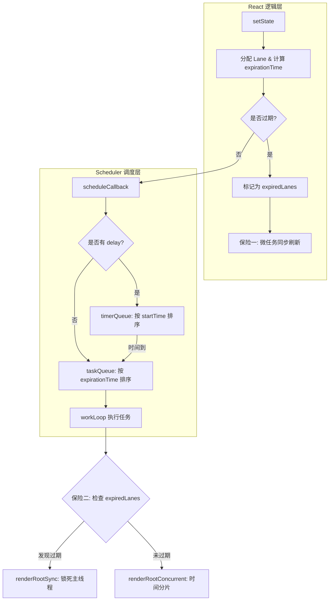

# React 调度与防饿死机制解析

本次对话深入探讨了 React 如何通过 Lane 模型和 Scheduler 协作，确保低优先级任务不会在并发模式下被无限期推迟（饿死）。

## 核心技术点

### 1. 防饿死“双保险”机制
React 通过两个阶段的物理检查，确保过期任务能够强制执行：

*   **保险一：微任务抢占（决策阶段）**
    在微任务中调用 `markStarvedLanesAsExpired`。一旦发现 Lane 过期，React 会绕过 Scheduler 的异步排队，在微任务结束前直接同步刷新（Flush Sync）。
*   **保险二：路径切换（执行阶段）**
    即便任务已经由 Scheduler 开始执行，React 依然会在渲染循环入口检查 `includesExpiredLane`。若已过期，则从 `renderRootConcurrent`（并发模式）强行切到 `renderRootSync`（同步模式），关闭时间分片，锁死主线程直到完成。

### 2. Scheduler 的双队列模型
Scheduler 内部维护两个最小堆（Min-Heap）来精细化管理任务：
*   **`taskQueue`**：存放就绪任务。按 `expirationTime` 排序。
*   **`timerQueue`**：存放延时任务（带有 `delay` 参数）。按 `startTime` 排序。

### 3. 动态闹钟机制
当 `taskQueue` 为空而 `timerQueue` 有任务时，Scheduler 不会空转，而是计算最近的一个任务开始时间，通过 `setTimeout` 设定一个“动态闹钟”，在到点时准时唤醒。

---

## 关键流程图



---

## 关键代码片段

### React 层的过期标记
```javascript
// packages/react-reconciler/src/ReactFiberLane.js
function markStarvedLanesAsExpired(root, currentTime) {
  let lanes = root.pendingLanes;
  while (lanes > 0) {
    const lane = pickArbitraryLane(lanes);
    const expirationTime = root.expirationTimes[laneIndex];
    if (expirationTime <= currentTime) {
      root.expiredLanes |= lane; // 提权为过期
    }
    // ...
  }
}
```

### Scheduler 层的队列转换
```javascript
// packages/scheduler/src/forks/Scheduler.js
function advanceTimers(currentTime) {
  let timer = peek(timerQueue);
  while (timer !== null) {
    if (timer.startTime <= currentTime) {
      pop(timerQueue);
      timer.sortIndex = timer.expirationTime; // 切换排序权重
      push(taskQueue, timer); // 进入就绪队列
    } else {
      return;
    }
    timer = peek(timerQueue);
  }
}
```

---

## 待办事项 / 深入思考
- [ ] **深入权衡分析**：研究 React 为何选择在过期时一次性锁死主线程，而不是逐步提权？
- [ ] **混合场景探索**：如果一个任务同时具备 `delay` 和高 `Priority`，它在 `timerQueue` 阶段会因为高优先级而获得优待吗？（提示：`timerQueue` 仅看 `startTime`）。
- [ ] **代码实验**：手动模拟一个耗时 10s 的渲染任务，观察 `markStarvedLanesAsExpired` 触发后页面的肉眼表现。
