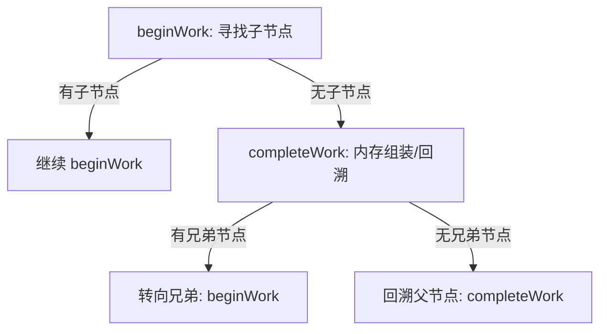

# 📝 React 渲染核心原理：Render 阶段深度解析

## 1. 核心工作流：深度优先遍历 (DFS)
React 并不一次性处理整棵树，而是将工作拆分为微小的单元，沿着 Fiber 链表进行“巡视”。

*   **beginWork (向下生长)**：
    *   **职责**：对比新旧 Props，调用组件，进行 Diff 算法，**创建子 Fiber 节点**。
    *   **比喻**：拿着设计稿进房间，列出该房间需要置办的“家具清单”。
*   **completeWork (向上回溯)**：
    *   **职责**：**创建 DOM 实例**（初次渲染），组装子树 DOM 结构，**收集副作用标签 (Flags)**。
    *   **比喻**：离开房间前，在内存中把家具组装成零件，封好快递盒。

## 2. 为什么设计为“走走停停”？
**核心目的：并发中断 (Concurrent Interruptibility)**

*   **任务切片**：React 将渲染过程拆解为以 Fiber 为单位的小任务。每处理完一个节点，React 都会检查是否有更高优先级的任务（如用户输入）。
*   **状态保留**：由于使用**链表**记录进度（`workInProgress` 指针），中断后可以像“书签”一样精准找回位置，无需从头开始。

## 3. 双缓存机制 (Double Buffering)
React 在内存中维护两棵树，确保用户感官的流畅：

| 属性 | `current` 树 | `workInProgress` (WIP) 树 |
| :--- | :--- | :--- |
| **状态** | 当前屏幕显示的真实内容 | 正在内存中静默构建的“下一帧” |
| **位置** | 挂载在真实 DOM 上 | 仅存在于 JS 内存中 |
| **容错** | 稳定，不轻易改动 | **可被随时丢弃或推倒重来** |

## 4. Render 阶段 vs Commit 阶段
这是理解“为什么不抖动”的关键：

1.  **Render 阶段 (beginWork/completeWork)**：
    *   **特性**：**异步、可中断**。
    *   **行为**：只在内存中操作 Fiber 和创建“离线 DOM”，**不触碰浏览器屏幕**。
2.  **Commit 阶段**：
    *   **特性**：**同步、不可中断**。
    *   **行为**：根据 Render 阶段收集的副作用，一次性执行 `appendChild` 等真实 DOM 操作。
