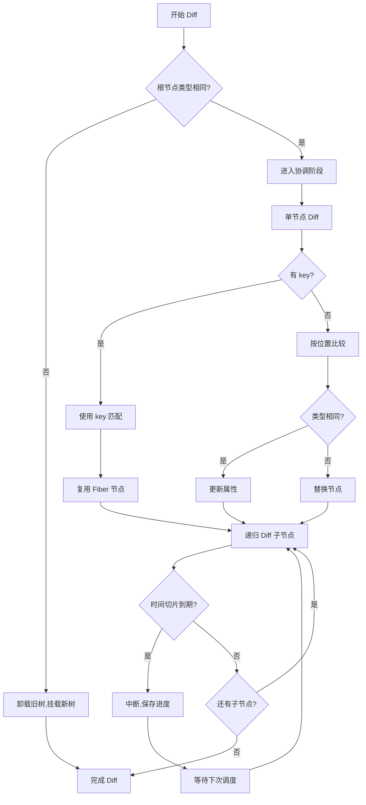
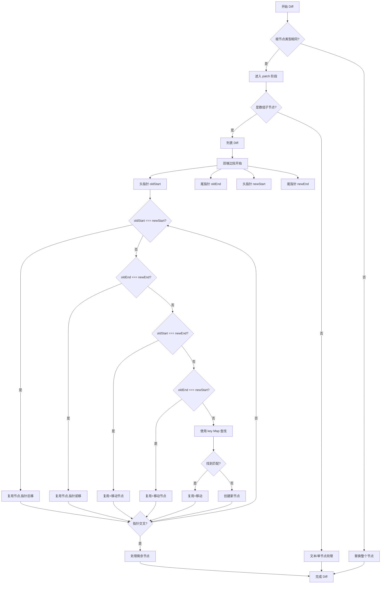
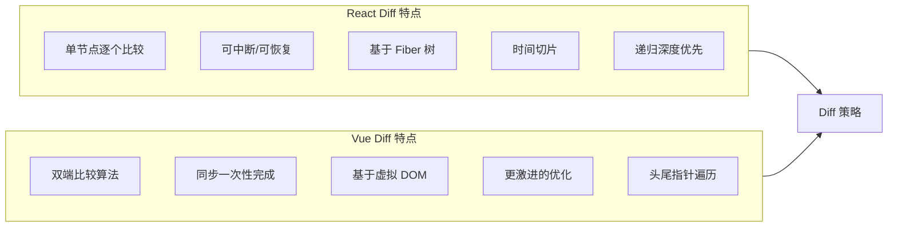

# Vue vs React Diff 算法对比

## React Diff 流程

## Vue Diff 流程

## 核心设计差异对比

## 设计原因分析

### React 的设计哲学

1. **可中断性优先**
   - React 追求"时间切片"，让高优先级任务可以打断低优先级渲染
   - 单节点 Diff 便于在任意节点处暂停和恢复
   - 如果采用双端比较，中断后恢复状态会很复杂

2. **Fiber 架构的必然选择**
   - Fiber 节点本身就是为可中断设计的
   - 每个 Fiber 节点保存了"工作进度"，可以随时中断和恢复
   - 递归的深度优先遍历天然适合这种"保存现场"的机制

3. **渐进式优化**
   - React 的 Diff 策略相对保守，优先保证正确性
   - 通过 key 优化列表性能，但不会做过于激进的假设

### Vue 的设计哲学

1. **性能优先**
   - Vue 假设大多数场景下，列表的变更都是"局部调整"
   - 双端比较能快速处理"头部插入"、"尾部追加"等常见场景
   - 一次性完成，避免状态保存的开销

2. **同步渲染模型**
   - Vue 2/3 的响应式系统是同步的
   - 不需要考虑中断和恢复，可以放心使用更复杂的算法
   - 双端比较 + key Map 的组合能最大化复用率

3. **更激进的优化假设**
   - 假设用户会正确使用 key
   - 假设列表操作以"局部调整"为主
   - 通过更复杂的算法换取更好的平均性能

## 性能特征对比

| 场景 | React | Vue |
|------|-------|-----|
| 头部插入 | O(n) | O(1) |
| 尾部追加 | O(n) | O(1) |
| 中间插入 | O(n) | O(n) |
| 随机重排 | O(n) | O(n) |
| 可中断性 | ✅ | ❌ |
| 内存开销 | 较高(Fiber) | 较低(VDOM) |

## 思考题

**现在请你思考：如果 React 也采用 Vue 的双端比较算法，会带来什么问题？反过来，如果 Vue 采用 React 的可中断 Diff，又会遇到什么挑战？**
